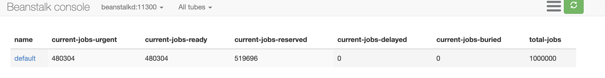

## Queues perfomance example
Producer: 1_000_000 messages, 
Request example: 
```
siege -c100 -r10 -b 'http://0.0.0.0:8080/bs?amount=1000 POST' -H "Content-Type: text/plain"
```
Each request generate 1000 messages, 1000*1000=1_000_000


### Beanstalkd 
1. Producer
Request: 
Result: 1.54 sec average response time of pushing 1000 mesage. 1.54s/1000 = 0,00154s. 
1.54ms - time per one message 
```
Transactions:                   1000 hits
Availability:                 100.00 %
Elapsed time:                  15.39 secs
Data transferred:               0.04 MB
Response time:                  1.54 secs
Transaction rate:              64.98 trans/sec
Throughput:                     0.00 MB/sec
Concurrency:                   99.90
Successful transactions:        1000
Failed transactions:               0
Longest transaction:            1.78
Shortest transaction:           1.43
```
2. Consumer 
    - Realease and Delete: 1_000_000/225766ms = 0.22ms per one message
    - Release: Can't finish, get stuck after ~ 500k successfully proccessed messages



