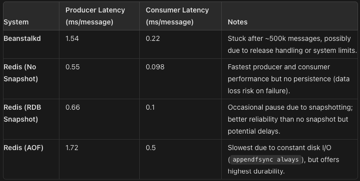

## Queues perfomance tests flow
Producer: 1_000_000 messages, 
Request example: 
```
siege -c100 -r10 -b 'http://0.0.0.0:8080/bs?amount=1000 POST' -H "Content-Type: text/plain"
```
Each request generate 1000 messages, 1000*1000=1_000_000


### Beanstalkd 
1. Producer
Request: siege -c100 -r10 -b 'http://0.0.0.0:8080/bs?amount=1000 POST' -H "Content-Type: text/plain"
Result: 1.54 sec average response time of pushing 1000 mesage. 1.54s/1000 = 0,00154s. 
1.54ms - time per one message 
```
Transactions:                   1000 hits
Availability:                 100.00 %
Elapsed time:                  15.39 secs
Data transferred:               0.04 MB
Response time:                  1.54 secs
Transaction rate:              64.98 trans/sec
Throughput:                     0.00 MB/sec
Concurrency:                   99.90
Successful transactions:        1000
Failed transactions:               0
Longest transaction:            1.78
Shortest transaction:           1.43
```
2. Consumer 
    - Realease and Delete: 1_000_000/225766ms = 0.22ms per one message
    - Release: Can't finish, get stuck after ~ 500k successfully proccessed messages


### Redis Queue 
NO snapshoting 
```
appendonly no
save ""
```
1. Producer 
Request: siege -c100 -r10 -b 'http://0.0.0.0:8080/redis?amount=1000 POST' -H "Content-Type: text/plain"
Result: 0.55 sec average response time of pushing 1000 mesage. 0.55/1000 = 0,00055s. 
0.55ms - time per one message
```
Transactions:                   1000 hits
Availability:                 100.00 %
Elapsed time:                   5.47 secs
Data transferred:               0.04 MB
Response time:                  0.54 secs
Transaction rate:             182.82 trans/sec
Throughput:                     0.01 MB/sec
Concurrency:                   99.63
Successful transactions:        1000
Failed transactions:               0
Longest transaction:            0.71
Shortest transaction:           0.46
```
2. Consumer 
Results: 1M/97899ms = 1M/98s = 10k/0.98s = 0.000098s per 1 job
```
Processed 1M jobs
1M: 97114ms elapsed
```

RDB snaphoting

Config for frequency of rbd snapshoting:
save 1 100000 10 1000 60 10000
1. Producer 
Request: siege -c100 -r10 -b 'http://0.0.0.0:8080/redis?amount=1000 POST' -H "Content-Type: text/plain"
Result: 0.66 sec average response time of pushing 1000 mesage. 0.66/1000 = 0,00066s. 
0.66ms - time per one message 
```
Transactions:                   1000 hits
Availability:                 100.00 %
Elapsed time:                   6.65 secs
Data transferred:               0.04 MB
Response time:                  0.66 secs
Transaction rate:             150.38 trans/sec
Throughput:                     0.01 MB/sec
Concurrency:                   99.81
Successful transactions:        1000
Failed transactions:               0
Longest transaction:            0.89
Shortest transaction:           0.52
```
During message creation were made 5 rdb snapshot, according to TIG stack

2. Consumer
Results: 1M/99899ms = 1M/100s = 10k/1s = 0.1ms per 1 job
```
Processed 1M jobs
1M: 99899ms elapsed
```
During message operating were made 16 rdbs snapshot, according to TIG stack

AOF

```
appendfsync always
save ""
```

1. Producer 
Request: siege -c100 -r10 -b 'http://0.0.0.0:8080/redis?amount=1000 POST' -H "Content-Type: text/plain"
Result: 1.72s sec average response time of pushing 1000 mesage. 1.72/1000 = 0,00172s. 
1.72ms - time per one message 

```
Transactions:                   1000 hits
Availability:                 100.00 %
Elapsed time:                  17.20 secs
Data transferred:               0.04 MB
Response time:                  1.72 secs
Transaction rate:              58.14 trans/sec
Throughput:                     0.00 MB/sec
Concurrency:                   99.85
Successful transactions:        1000
Failed transactions:               0
Longest transaction:            2.15
Shortest transaction:           1.37
```
2. Consumer 
Results: 1M/523979ms = 1M/524s = 1908/1s = 0.5ms per 1 job
```
Processed 1M jobs
1M: 523979ms elapsed
```

## Summary

### Perfomance Comparison Table


#### Performance Trade-Offs
1.  Latency and Throughput
    -   Redis (No Snapshot) offers the best performance in terms of both producer and consumer latency, making it ideal for scenarios where low-latency and high throughput are critical (e.g., real-time systems with high message rates).
    -   Beanstalkd performs moderately well on producer and consumer throughput but struggles with reliability during high-load scenarios, especially after handling around 500k messages. This may indicate a bottleneck in handling larger message queues or specific failure during message release.
    -   Redis (RDB) provides slightly slower producer and consumer performance compared to the no-snapshot option, largely due to snapshotting overhead. The occasional pause caused by snapshots (especially during high traffic) can introduce latency spikes.
    -   Redis (AOF) is the slowest, particularly on the producer side, as the system must write each message to disk. While it ensures data durability, the cost is significantly higher latency and lower throughput.

2.  Durability and Reliability
    -   Redis (No Snapshot) is not suitable for systems requiring data persistence since it has no mechanism to ensure data recovery in the event of failure. It would be optimal for ephemeral data streams where data loss is acceptable.
    -   Redis (RDB Snapshot) strikes a balance between performance and durability. Snapshotting reduces the risk of data loss, but there is still a window of potential data loss between snapshots. For systems with moderate durability needs, this mode may be an acceptable trade-off.
    -   Redis (AOF) offers the best durability since every operation is logged. However, its higher latency and disk I/O overhead make it less suited for high-throughput scenarios where performance is paramount. It is best for systems where data integrity and recovery are critical.
3.  Reliability Issues
    -   Beanstalkd's failure after handling ~500k messages could indicate problems with either its memory management or its release mechanism under load. This presents a significant concern for high-reliability systems, as such issues can lead to downtime or data loss.
    -   Redis (RDB) introduces some risk related to snapshot intervals; data added since the last snapshot could be lost during a crash.
    -   Redis (AOF), with appendfsync always, sacrifices performance for reliability, ensuring the least amount of data loss in the event of a failure, but it is still essential to manage the underlying disk subsystem efficiently.

#### Conclusion
1. For Low-Latency, High Throughput Systems:
    - Redis (No Snapshot) is the best choice, as it offers the lowest latency and fastest throughput, with the caveat that durability is sacrificed. It is optimal for use cases like real-time messaging or analytics systems, where speed is prioritized over persistence.
2.  For Durability-Critical Applications:
    - Redis (AOF) is the preferred solution. Despite its slower performance, it ensures data is written to disk after every operation, making it suitable for systems that cannot tolerate data loss (e.g., financial transactions or mission-critical logging systems).
3.  For Balanced Use Cases:
    - Redis (RDB Snapshot) offers a reasonable middle ground between performance and durability. It can be suitable for applications that need good throughput but can tolerate small windows of data loss (e.g., batch processing systems where losing a few seconds of data is acceptable).
4. Beanstalkd, despite its simplicity, shows significant limitations in handling very high message loads and may not be suitable for systems requiring long-term reliability and robustness under stress. For smaller, less critical workloads, it could be considered, but Redis generally outperforms it in high-load scenarios.


